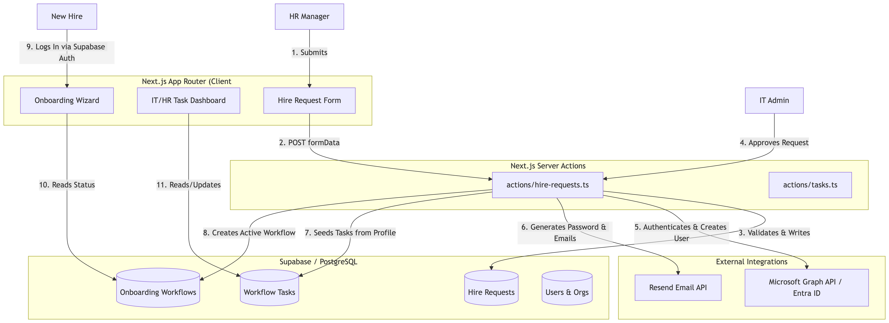

# Harmony OP System Architecture

> A visual guide to the data flow, multi-tenant isolation, and provisioning lifecycle.

## High-Level Data Flow



## Security & Multi-Tenancy

Every database query and server action in Harmony OP is scoped by the `orgId` of the currently authenticated user. 

```typescript
// Example of strict tenant isolation in Drizzle ORM
const requests = await db.query.hireRequests.findMany({
  where: eq(hireRequests.orgId, currentUser.orgId)
});
```

## The "God-Mode" Provisioning Lifecycle

When an IT/HR Admin approves a hire request in `actions/hire-requests.ts`, the following 5-phase transaction occurs:

1. **Authentication:** Fetches OAuth 2.0 token from `login.microsoftonline.com` using the organization's `clientSecret`.
2. **User Creation:** Posts to `graph.microsoft.com/v1.0/users` to create the Entra ID object with a securely generated temporary password.
3. **Database Sync:** Upserts the newly created Microsoft employee into our internal `users` table to ensure ID tracking.
4. **Workflow Generation:** Creates a new `onboardingWorkflows` record and seeds individual IT/HR/Hardware tasks from the role's assigned `profileTasks`.
5. **Notification:** Triggers Resend to email the employee's temporary Microsoft 365 credentials to their personal email or their manager.